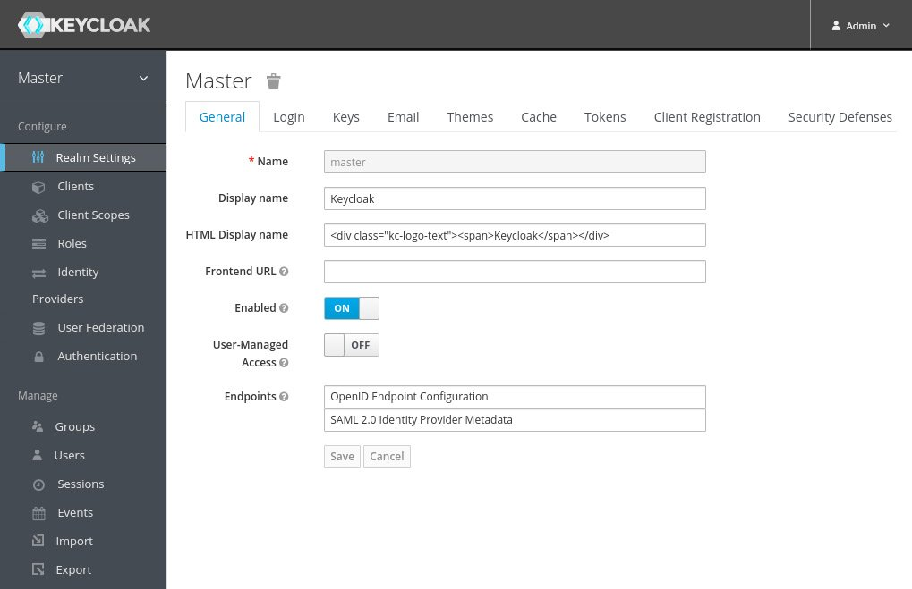
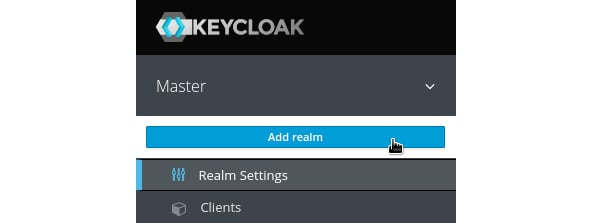
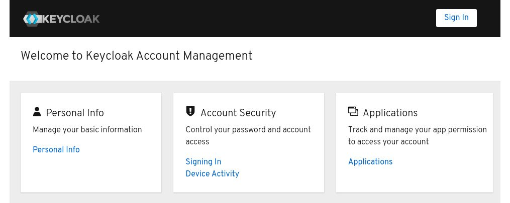

# Lab 1 : Discovering the Keycloak admin and account consoles

In this section, we will take a look at the Keycloak admin and account consoles. The admin console is an extensive console that allows you to configure and manage Keycloak. The account console, on the other hand, is there to allow your end users to manage their accounts.

## Getting started with the Keycloak admin console
In this section, you will learn how to log in to the Keycloak admin console as well as learn how to set up the basic configuration needed to secure your first application.

The Keycloak admin console provides an extensive and friendly interface for administrators and developers to configure and manage Keycloak.

To access the admin console, open http://localhost:8080/auth/admin/ in a browser. You will be redirected to the Keycloak login pages, where you can log in with the admin username and password you created in the previous section while installing Keycloak.

Once you have logged in, you will see the configuration for the master realm in Keycloak, as shown in the following screenshot:

You will learn a lot more about the admin console throughout the training, but let's go through a few steps to make your Keycloak application ready to start securing applications.

###Creating and configuring a realm
The first thing you will want to do is create a realm for your applications and users. Think of a realm as a tenant. A realm is fully isolated from other realms, it has its own configuration, and its own set of applications and users. This allows a single installation of Keycloak to be used for multiple purposes. For example, you may want to have one realm for internal applications and employees, and another realm for external applications and customers.

To create a new realm, hover your mouse over the realm selector in the top-left corner (just below the Keycloak logo). When hovering your mouse over the realm selector, you will see a list of realms, including a button to create a new realm. Click on the **Add realm** button:

On the next page, enter a name for the realm. As the name is used in URLs, the name should ideally not use special characters that need escaping in URLs (such as spaces). Once created, you can set a human friendly display name. For example, use **myrealm** for the name, and **My Realm** for the display name.

###Creating a user
Once you have created the realm, let's create the first user in the realm:

1. From the left-hand menu, click on **Users**, and then click on **Add User**.
2. Enter a memorable username, and also enter a value of your choice for email, first name, and last name.
The **Email Verified** option can be selected by an administrator if they know this is the valid email address for the user.
3. **Required User** Actions allows an administrator to require a user to perform some initial actions on the next login; for example, to require the user to review their profile, or to verify their email address.
4. Remember to click on **Save** after you have completed the form.

A user has a few standard built-in attributes, such as first name, but it is also possible to add any custom attributes through the **Attributes** tab.

Before the user can log in, you have to create an initial temporary password. To do this, click on the **Credentials** tab. In the **Set Password** section, enter a password and click **Set Password**.

If the **Temporary** option is enabled, the user is required to change the password when logging in for the first time. In cases where an administrator creates the user, this makes a lot of sense.

###Creating a group

Next, let's create a group and add the user we previously created to the group. From the menu on the left-hand side, click on **Groups**, and then click on **New**.

Enter a name for the group, for example, **mygroup** , and then click on **Save** .

Once you have created the group, you can add attributes to the group. A user inherits all attributes from a group it belongs to. This can be useful if, for example, you have a group for all employees in an office and want to add the office address to all employees in this group.

You can also grant roles to a group, which again is inherited by all members of the group.

To add the user to the group, go back to the **Users** page. Click **View all** users and select the user you created previously.

Next, click on the **Groups** tab. In the right-hand column, select the group you created previously and click on **Join** to add the user to the group.

###Creating a global role
To create a global role, click on **Roles** in the menu on the left-hand side, and then click on **Add Role**. Enter a role name, for example, **myrole**. You can also add a description to the role, which can be especially useful if there are other administrators.

Any role in Keycloak can be turned into a composite role, allowing other roles to be added to the role. A user who is granted a composite role will dynamically be granted all roles within the composite role. Composite roles can even contain other composite roles. This feature can be very powerful, but, at the same time, should be used with some care. Composite roles can be a bit difficult to manage, and can also have a performance overhead if overused, especially if there are many layers of composite roles.

To add the user to the role, go back to the Users page. Click View all users and select the user you created previously.

Next, click on the **Role Mappings** tab. In the left-hand column, select the role you created previously and click on **Add selected** to add the user to the role.

You have now created all the required initial configuration to get started securing your first application, but first let's take a look at the Keycloak account console, which lets users manage their own accounts.

## Getting started with the Keycloak account console

The Keycloak account console provides an interface where users can manage their own accounts, including the following:

- Updating their user profile
- Updating their password
- Enabling second factor authentication
- Viewing applications, including what applications they have authenticated to
- Viewing open sessions, including remotely signing out of other sessions

To access the account console, open http://localhost:8080/auth/realms/myrealm/account/ in a browser (if you used a different realm name in the previous section, replace myrealm with the name of your realm). You will be redirected to the Keycloak login pages, where you can log in with the username and password you created in the previous section while creating your first user:

**Tip** : You can also find the URL of the account console through the Keycloak admin console. In the admin console, click on Clients, and then you will find the URL of the account console next to the account client.

You have now learned how Keycloak not only provides an extensive admin console, but also a self-management console for users of your applications to manage their own accounts.

