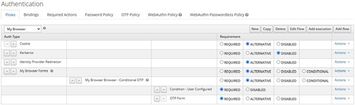
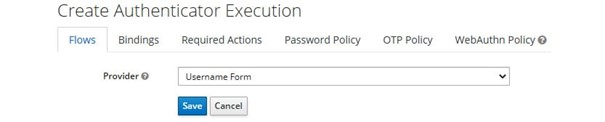
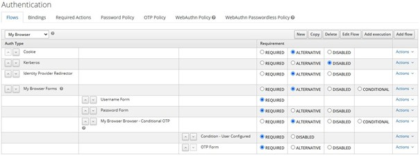
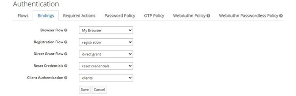

# Lab 10 : Configuring a custom authentication flow

Keycloak allows you to customize any of the authentication flows from the Bindings tab. To do this, you can change the settings of the authentication flow definition associated with them or create your own using an existing one as a template.

The easiest – and recommended – way to create a flow is to use an existing definition as a template by selecting a definition from the Flows tab and clicking on the Copy button. The reason for this is that you can easily roll back your changes and switch to the definition you used as a template, in case the flow is broken by your changes.

In this lab we are going to customize the default **Browser Flow** and see how it affects end users authenticating in a realm using a browser.

##Lab instructions

First, select **Browser Flow** from the select box of the Flows tab. Then, click on the **Copy button** to create a new flow based on it. You should be prompted to choose a name for the new flow. Let's name it **My Browser** and click on the OK button to create a new flow.

Now, let's change how users authenticate in the realm by gathering both the username and password in different steps and from different pages, instead of asking for the credentials using a single login page. For that, click on the **Actions** menu on the right-hand side of the **Username Password Form** execution and click on the **Delete** option. At the moment, your flow should look as follows:

Now, let's add two steps to this flow to ask the user for the username and then ask for the password. For that, click on the **Actions** menu on the right-hand side of the **My Browser Forms** subflow and click on the **Add execution button**.

Once you've done that, you should be redirected to a page where you can choose the authentication execution to include as a step of the subflow:

On this page, you should be able to select from a vast list of authentication executions. In our case, we are going to select **Username Form** from the Provider select box and click on the **Save** button to add the execution to the subflow.

Once the execution has been added to the flow, you should see it within the subflow. By default, executions are added to the bottom of the flow, but in our case, we want this execution at the top of the subflow so that we can obtain the username first. For that, click on the up arrow on the left-hand side of **Username** Form until it becomes the first execution in the subflow.

Perform the same steps you did previously to add the **Password Form** authentication execution to the subflow to obtain the password and authenticate the user. Make sure **Password Form** is the second execution in the subflow.

Let's make sure that both the **Username Form** and **Password Form** executions are marked as **REQUIRED**. For that, click on the **REQUIRED** setting for each authentication execution. This is an important step as it forces our end users to provide both pieces of information when they're logging into the realm.

Now, the **My Browser** authentication flow should look like this:

Finally, click on the **Bindings** tab and change **Browser Flow** to associate it with the **My Browser** authentication flow definition we just created. At this point, the configuration in the **Bindings** tab should look as follows:

Now, let's try to log into the Keycloak account console as alice. For that, open your browser at http://localhost:8080/auth/realms/myrealm/account and log in using your user credentials. When authenticating to the realm, you should notice that the username and password of the user are obtained and validated in multiple steps.

## Summary :
In this lab, you learned about the main aspects of authentication flows. You learned that Keycloak allows you to customize how users and clients authenticate by creating or changing authentication flow definitions. You also learned that by leveraging authentication flows, you can adapt Keycloak so that it fits into your authentication requirements.

 
