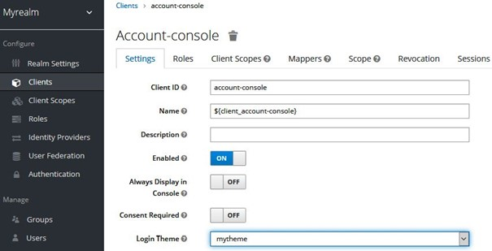
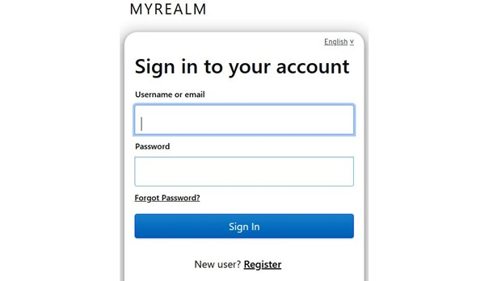

# Lab 11 : Creating and deploying a new theme

One of the main customization hooks – and probably what people use most – is changing Keycloak built-in themes to fit into your branding and to respect your UI and UX requirements.
Keycloak provides an amazingly simple experience for changing themes and allows you to change most – if not all – of its UI, from the end user-facing pages to the administration console itself.
In this lab, you will learn about the basics of theming by going through a basic example of how to change the look and feel of the login page. By understanding these basics, you should then be able to apply the same concepts to any other UI you want to customize.

## Customize the login page

Creating a new theme involves creating a directory, configuring the theme using a **theme.properties** file, and adding any static resource you may require, including CSS stylesheets, JavaScript libraries, and message bundles.

For this topic, you should be able to use a pre-defined theme available from the GitHub repository at the following directory:

```
$ cd lab11/themes/mytheme/src/main/resources/theme/mytheme
```

In the **mytheme** directory, you have the following structure:

```
login/
├── messages
└── resources
    ├── css
    ├── img
    └── jsCopy
```

The **mytheme** theme was built to change only the **login** theme type. In this example, we are customizing only the login page.

When defining a theme type, you should have a standard directory structure as follows:

- The **resources** directory is the place from where Keycloak is going to look up static resources used by your theme.
- The **messages** directory is the place from where message bundles are going to be loaded.

Within the **resources** directory, it is a best practice to have specific directories for each type of resource you need in your theme, such as CSS stylesheets, JavaScript, and image files.

**Note** : In our example, the **messages** directory is empty because you will not need to define message bundles but rely on those already available from the **base** theme.

As mentioned earlier, theme types must have a **theme.properties** file to define its configuration. In our example, this file contains only the basic settings to change the login page using custom CSS styles. Let's understand how this file is defined by opening the file that is located in the GitHub repository at [lab11/themes/mytheme/src/main/resources/theme/mytheme/login/theme.properties](./themes/mytheme/src/main/resources/theme/mytheme/login/theme.properties):

```yaml
# Inherit resources and messages from the keycloak theme
parent=keycloak
# Define the CSS styles
styles=css/login.css css/bootstrap.min.css css/signin.css
# Mapping CSS classes from Keycloak to custom CSS classes
kcHtmlClass=login-page
kcLoginClass=form-signi
```

From the preceding snippet, you will see that mytheme is extending the keycloak theme and defining some additional CSS stylesheets. In this file, there is also a mapping between the Keycloak CSS classes to those defined in a custom CSS stylesheet at [lab11/themes/mytheme/src/main/resources/theme/mytheme/login/css/signin.css](./themes/mytheme/src/main/resources/theme/mytheme/login/css/signin.css).
Now, let's use this theme when authenticating to the account console. For that, you need to deploy the theme to the server by building the example project and deploying the JAR:

```
$ cd lab11/themes/mytheme
$ ./mvnw clean package
$ cp target/mytheme.jar $KC_HOME/standalone/deployments
```

After performing these steps, log in to the administration console as the administrator user. Once you are in the console, select the **account-console** client from the list of clients and then, at the client details page, select the **mytheme** theme from the list of options for the **Login Theme** setting. At the end, the **account-console** client settings should look as follows:



Now, log out from the administration console and try to log in to the account console by opening http://localhost:8080/auth/realms/myrealm/account. If everything is properly configured, the login page should have a different layout, as follows:



One important tip for when creating themes is to disable caching so that changes you are making to your theme are automatically reflected at runtime. By default, Keycloak caches templates and theme configuration for performance reasons. To disable caching, change the following settings in the $KC_HOME/standalone/configuration/standalone.xml file:

```
<theme>
    <staticMaxAge>-1</staticMaxAge>
    <cacheThemes>false</cacheThemes>
    <cacheTemplates>false</cacheTemplates>
</theme>
```

## Summary

In this lab you learned about how to create and deploy a theme to Keycloak. For that, you were provided with a basic example that changes the layout of the login page. You also learned that when creating a new theme, you usually want to disable caching so that any change you make to a theme is reflected when reloading the server pages.


