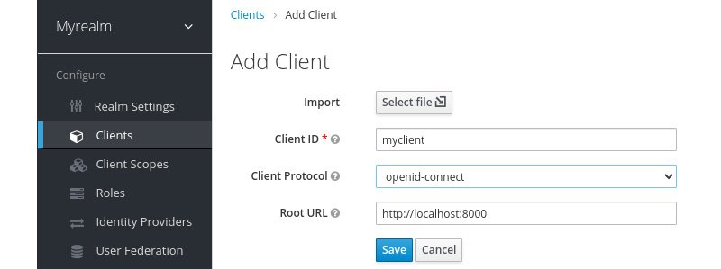

# Lab 2 : Securing Your First Application

In this lab, you will learn how to secure your first application with Keycloak. To make things a bit more interesting, the sample application you will be running consists of two parts, a frontend web application and a backend REST API. This will show you how a user can authenticate to the frontend, and also how the frontend is able to securely invoke the backend.

By the end of this lab, you will have a basic understanding of how applications can be secured by Keycloak by leveraging OpenID Connect.

## Technical requirements

To run the sample application included in this chapter, you need to have Node.js (https://nodejs.org/) installed on your workstation.

You also need to have a local copy of this lab. 

## Running the application
In this section, you will learn how to run the sample application.

If you don't already have Node.js installed on your workstation, go to https://nodejs.org/ for instructions on how to install it.

To run the frontend on Node.js, open a terminal and run the following commands :

```
$ cd ./lab2/frontend/
$ npm install
$ npm start
```

Next, open a new terminal to run the backend using the following commands:

```
$ cd ./lab2/backend/
$ npm install
$ npm start
```

Now that you have the sample application running with Node.js, you can register it with Keycloak, which we will cover in the next section.

## Keycloak setup 

Prior to continuing this section, you should have Keycloak running with the realm created as covered in the previous lab. In summary, what you require before continuing is the following:

- Keycloak up and running
- A realm named myrealm
- A global role named myrole
- A user with the preceding role

Before an application can log in with Keycloak, it has to be registered as a client with Keycloak.

Before registering the frontend, let's see what happens if an unregistered application tries to authenticate with Keycloak. Open http://localhost:8000 and then click on the Login button.

You will see an error page from Keycloak with the message Client not found. This error is telling you that the application is not registered with Keycloak.

To register the frontend with Keycloak, open the Keycloak admin console. At the top of the menu on the left-hand side, there is an option to select what realm you are working with. Make sure you have selected the realm named myrealm. In the menu on the left-hand side, click on **Clients**, and then click on **Create**.

Fill in the form with the following values:

- Client ID: myclient
- Client Protocol: openid-connect
- Root URL: http://localhost:8000

The following screen shows the **Add Client** form with the values you need to fill in:



Once you have filled in the form, click on Save. After you click Save, you will see the full configuration for the client. There are two configuration options that are particularly interesting at this point:

- **Valid Redirect URIs** : This value is very important in an OpenID Connect authorization code flow when a client-side application is used. A client-side application is not able to have any credentials as these would be visible to end users of the application. To prevent any malicious applications from being able to masquerade as the real application, the valid redirect URIs instruct Keycloak to only redirect the user to a URL that matches a valid redirect URI. In this case, since the value is set to http://localhost:8000/*, an application hosted on http://attacker.com would not be able to authenticate.
- **Web Origins** : This option registers the valid web origins for the application for **Cross-Origin Resource Sharing (CORS)** requests. To obtain tokens from Keycloak, the frontend application has to send an AJAX request to Keycloak, and browsers do not permit an AJAX request from one web origin to another, unless **CORS** is used

Now you can go back to the frontend by opening http://localhost:8000. This time, when you click on the **Login** button, you will see the Keycloak login page. Log in with the username and password you created during the previous chapter.

Let's take a look at the ID token that Keycloak issued. Click on the **Show ID Token** button. The ID token that is displayed will look something like the following:

```
{
  "exp": 1603912252,
  "iat": 1603911952,
  "auth_time": 1603911952,
  "jti": "363b94b8-7e0c-4852-8287-d331c98153f2",
  "iss": "http://localhost:8080/auth/realms/myrealm",
  "aud": "myclient",
  "sub": "67855660-fd6e-4416-96d1-72c99db5e525",
  "typ": "ID",
  "azp": "myclient",
  "nonce": "b59c4dbf-d196-4af7-9451-8020b153caff",
  "session_state": "32e2501f-f5ca-4d73-9fad-067d4c52835a",
  "at_hash": "7p1VYLHv2T5qRAf2X9UzSw",
  "acr": "1",
  "email_verified": false,
  "realm_access": {
    "roles": [
      "offline_access",
      "uma_authorization",
      "myrole"
    ]
  },
  "name": "Stian Thorgersen",
  "preferred_username": "st",
  "locale": "en",
  "given_name": "Stian",
  "family_name": "Thorgersen",
  "email": "st@localhost"
}
```

Here is a list of some of the more interesting values within the ID token:

- **exp**: This is the date and time the token expires in seconds since 01/01/1970 00:00:00 UTC (often referred to as Unix or Epoch time).
- **iss**: This is the issuer of the token, which you may notice is the URL of the Keycloak realm.
- **sub**: This is the unique identifier of the authenticated user.
- **name**: This is the first name and last name of the authenticated user.
- **preferred_username**: This is the username of the authenticated user. You should avoid this as a key for the user as it may be changed, and even refer to a different user in the future. Instead, always use the sub field for the user key.


The ID token is used by the application to establish the identity of the authenticated user.

Next, let's take a look at the access token. Click on the Show **Access Token** button. Let's also take a look at some fields in this token:

- **allowed-origins**: This is a list of permitted web origins for the application. The backend service can use this field when deciding whether web origins should be permitted for CORS requests.
- **realm_access**: This contains a list of global roles. It is the intersection between the roles granted to the user, and the roles the client has access to.
resource_access: This contains a list of client roles.
- **scope**: Scopes can be used both to decide what fields (or claims) to include in the token, as well as be used by backends to decide what APIs the token can access.


Currently, the information within the tokens are the default fields available in Keycloak. If you want to add additional information, Keycloak is very flexible in allowing you to customize the contents within the tokens.

Let's give this a go by adding a picture for the user. Leave the tab with the frontend open, and then open a new tab with the Keycloak admin console. In the menu on the left-hand side, click on Users, then click on View all users, and select the user you created previously. Now let's add a custom attribute to the user. Click on Attributes. In the table, there will be two empty input fields at the bottom. In the Key column. set the value to picture, and in the Value column, set the value to the URL to a profile picture. Then, click on Add:


Now, go back to the tab where you have the frontend open. To display the profile picture, you can click on the Refresh button. When you click on this button, the tokens will be refreshed, and the new ID token will now contain the picture attribute you just added, which allows the application to display a profile picture for the user.

Next, you will learn how to securely invoke the backend from the frontend.

##Securely invoking the backend REST API

Now, open http://localhost:3000/ and click on the **Public endpoint** link. You will see a message saying **Public message!**. The public endpoint is not secured by Keycloak, and can be invoked without an access token.

Next, let's try the secured endpoint that is protected by Keycloak. Open http://localhost:3000/ again. This time, click on the **Secured endpoint** link. Now you will see a message saying **Access denied**. The Keycloak Node.js adapter is denying requests to this endpoint as it requires a valid access token to invoke the endpoint.

Let's now try to invoke the secured endpoint from the frontend. Open http://localhost:8000/ and click on **Invoke Service**. You will now see a message displayed saying **Secret message!**. If instead you get the message **Access Denied**, this is most likely caused by the user not having the **myrole** role.

When you click **Invoke Service**, the frontend sends an AJAX request to the backend service, including the access token in the request, which allows the backend to verify that the invocation is done on behalf of a user who has the required role to access the endpoint.

### Summary
In this lab, you learned how to secure your first application, consisting of a frontend web application and a backend REST API with Keycloak. You also gained a basic understanding of how Keycloak leverages OpenID Connect to make this all happen in a standard and secure way. Together with what you learned in the first lab of the training, you now have a solid foundation to start learning more about Keycloak.

In the next labs, we will dive deeper into securing applications with Keycloak, giving you a better understanding of how it all works.