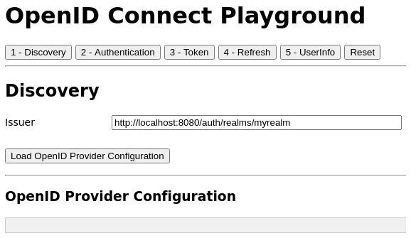
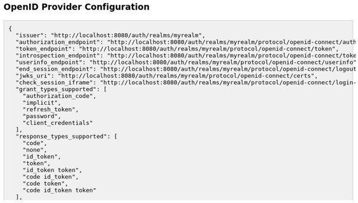
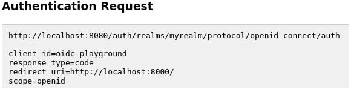
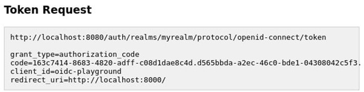
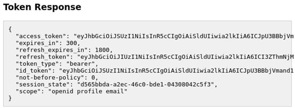
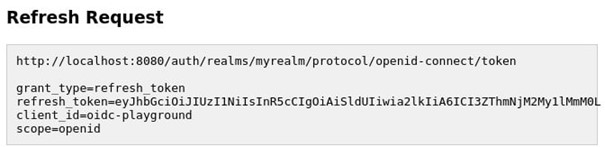
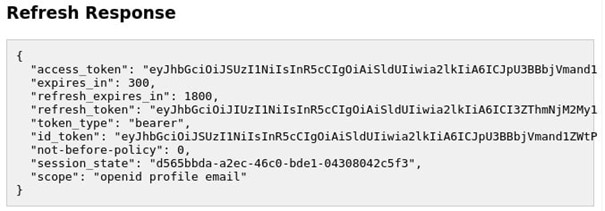
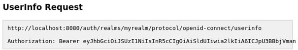
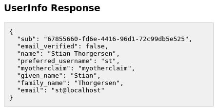

# Lab 3 : The OpenID Connect playground

In this lab we are going to use the OpenID Connect (OIDC) playground in order to understand and experiment with OIDC in a practical way.
The playground application does not use any libraries for OIDC, but rather all OIDC requests are crafted by the application itself. One thing to note here is that this application is not implementing OIDC in a secure way, and is ignoring optional parameters in the requests that are important for a production application. There are two reasons for this. Firstly, it is so you can focus on understanding the general concepts of OIDC. Secondly, if you decide to implement your own application libraries for OIDC you should have a very good understanding of the specifications, and it is beyond the scope of this training to cover OIDC in that much detail.

## Starting the lab

To run the OIDC playground application, open a terminal and run the following commands:

```
$ cd lab3/oidc-playground
$ npm install
$ npm start
```

To verify the application is running, open http://localhost:8000/ in your browser. The following screenshot shows the OIDC playground application page:




In order to be able to use the playground application you need Keycloak running, a realm with a user that you can log in with, and have a client with the following configuration:

- Client ID: oidc-playground
- Access Type: public
- Valid Redirect URIs: http://localhost:8000/
- Web Origins: http://localhost:8000

In the next section, we will start taking a deeper look at OIDC by leveraging the playground application, starting with understanding how applications can discover information about an OpenID Provider.

## Understanding the Discovery endpoint

To better understand the OpenID Provider Metadata, open the OIDC playground in your browser. You can see there is already a value filled in for the issuer input.
The value for the issuer URL that is already filled in is http://localhost:8080/auth/realms/myrealm. Let's break this URL apart and take a look at the parts of the issuer URL:

- **http://localhost:8080/auth**: This is the root URL for Keycloak. In a production system, this would obviously be a real domain name and would use HTTPS (for example, https://auth.mycompany.com/).
- **/realms/myrealm**: As Keycloak supports multi-tenancy, this is used to separate each realm in your Keycloak instance.

If you have Keycloak running on a different hostname, port, or have a different realm, you should change the issuer field. Otherwise, you can leave it as is.

Now click on Load OpenID Provider Configuration. When you click on this button, the playground application sends a request to http://localhost:8080/auth/realms/myrealm/.well-known/openid-configuration (assuming you left the issuer URL untouched) and receives a response in the form of the OpenID Provider Metadata for this Keycloak instance. The returned metadata is displayed in the OpenID Provider Configuration section of the playground application.

The following screenshot from the playground application shows an example of the loaded OpenID Provider Metadata:



In the following list, we'll take a look at what some of these values mean:

- **authorization_endpoint**: The URL to use for authentication requests
- **token_endpoint**: The URL to use for token requests
- **introspection_endpoint**: The URL to use for introspection requests
- **userinfo_endpoint**: The URL to use for UserInfo requests
- **grant_types_supported**: The list of supported grant types
- **response_types_supported**: The list of supported response types

With all of this metadata, the Relying Party can make intelligent decisions about how to use the OpenID Provider, including what endpoints to send requests to and what grant types and response types it can use.
If you took an extra good look at the metadata, you may have noticed that Keycloak supports the **authorization_code** grant type and the **code** and **token** response types. We'll use this grant type and these response types to authenticate the user in our playground application in the next section.

## Authenticating a user
Let's now see the OIDC flow in action by using to the OIDC playground application. As you already loaded the OpenID Provider Metadata in the previous section, the playground application already knows where to send the authentication request. To send an authentication request, click on the button labelled **2 - Authentication**.

The form that is displayed has the following values that you should fill in:

- **client_id**: This is the client ID for the application registered with Keycloak. If you used a different value than oidc-playground when creating the client, you should change this value.
- **scope**: The default value is openid, which means we will be doing an OpenID request. Leave this as-is for now.
- **prompt**: This can be used for a few different purposes. For example, if you enter the value none in this field, Keycloak will not display a login screen to the user, but will instead only authenticate the user if the user already is logged in with Keycloak. You can also use the value login to require the user to log in again even if they are already logged in with Keycloak.
- **max_age**: This is the maximum number of seconds since the last time the user authenticated with Keycloak. If, for example, you set this field to 60, it means that Keycloak will re-authenticate the user if it was more than 60 seconds since the user last authenticated.
- **login_hint**: If the application happens to know the username of the user that it wants to authenticate it can use this parameter to have the username filled in automatically on the login page.

Now let's take a look at what the authentication request will look like by clicking on the button labeled Generate Authentication Request. You will now see the actual request that the application will redirect the user-agent to in order to initiate the authentication.

The following screenshot from the playground application shows an example authentication request:



This includes setting the **response_type** parameter to **code**, meaning that the application wants to receive an authorization code from Keycloak.

Next, click on the button labeled **Send Authentication Request**. You will now be redirected to the Keycloak login pages. Fill in the username and password for your user and click on **Log In**.

If you want to experiment a bit you can, for example, try the following steps:

- **Set prompt to login**: With this value, Keycloak should always ask you to re-authenticate.
- **Set max_age to 60**: With this value, Keycloak will re-authenticate you if you wait for at least 60 seconds since the last time you authenticated.
- **Set login_hint to your username**: This should prefill the username in the Keycloak login page.

If you try any of the preceding steps, don't forget to generate and send the authentication request again to see how Keycloak behaves.

After Keycloak has redirected back to the playground application, you will see the authentication response in the **Authentication Response** section. The code is what is called the authorization code, which the application uses to obtain the ID token and the refresh token.

Now that the application has the authorization code, you can go ahead and exchange it for some tokens.

Click on the button labeled **3 - Token**. You will see the authorization code has already been filled in on the form so you can go ahead and click on the button labeled **Send Token Request**.

Under **Token Request**, you can see the request the application sends to the token endpoint provided by Keycloak. It contains the authorization code and sets the **grant_type** to **authorization_code**, which means the application wants to exchange an authorization code for tokens.

An example Token Request is shown in the following screenshot from the playground application:



Under **Token Response**, you can see the response that Keycloak sent to the application. If you get the error with the value **invalid_grant**, it is most likely for one of the following two reasons:

- **You did the steps a bit too slowly**: The authorization code is only valid for one minute by default, so if it took more than one minute between receiving the authentication response from Keycloak and sending the token request, the request will fail.
- **You sent the token request more than once**: The authorization code is only valid once, so if it is included in more than one token request the request will fail.

The following screenshot shows an example successful token response from the playground application:



Let's take a look at the values within this response:

- **access_token**: This is the access token, which in Keycloak is a JWS. We'll look more at this in the next lab when we cover OAuth 2.0 in more detail.
- **expires_in**: As the access token is sometimes opaque, this will give the application a hint when the token expires.
- **refresh_token**: This is the refresh token, which we will look more at in the next section.
- **refresh_token_expires_in**: The refresh token is also opaque, and this gives the application a hint when the refresh token expires.
- **token_type**: This is the type of the access token, which in Keycloak is always bearer.
- **id_token**: This is the ID token, which we will look at in more detail in the next section.
- **session_state**: This is the ID of the session the user has with Keycloak.
- **scope**: The application requests a scope from Keycloak in the authentication request, but the actual returned scope of the tokens may not match the requested scope.

## Refresh token

Next, let's try to refresh the ID token. Click on the button labeled **4 – Refresh**, then click on the button labeled **Send Refresh Request**.

In the **Refresh Request** window, you will see the request sent by the playground to the Keycloak Token endpoint. It uses the grant type **refresh_token**, and includes the refresh token and the client ID.

The following screenshot from the playground applications shows an example refresh request:



Under the **Refresh Response** you will see the response Keycloak sent to the playground. It is pretty much the same as the response for the original token request.

The following screenshot from the playground applications shows an example refresh response:



One thing to notice here is that the refresh response also includes a refresh token. It is important that the application uses this updated refresh token the next time it wants to refresh the ID token. This is important for a few reasons, including the following:

- **Key rotation**: Keycloak may rotate its signing keys, and it relies on clients receiving new refresh tokens signed with the new keys.
- **Session idle**: A client (or a session) has a feature called session idle, which means a refresh token may have shorter expiration than the associated session.
- **Refresh token leak detection**: To discover leaked refresh tokens, Keycloak will 
not allow the re-use of refresh tokens. This feature is currently disabled by default in Keycloak.

Finally, under **ID Token** you may notice that the token has more or less the same values except the expiration time (exp), the issue time (iat), and the token ID (jti) have changed.

Another benefit of refreshing the token is that your application can update information about the user from Keycloak without having to re-authenticate. We'll now experiment a bit with this.

For the next few sections, you should keep the playground application open. In a new browser window open the Keycloak Admin Console, click on Users and locate the user you used when authenticating to the playground application.

First, let's try to update the user profile.

## Updating the user profile

Change the email, first name, and last name of the user. Then go back to the playground application and click on the **Send Refresh Request** button. You will now notice that the user profile was updated.

Now that you have tried updating the user profile, let's try to add a custom property to the user.

## Adding a custom property
Let's take a look at the steps to add a custom property:

1. Going back to the Keycloak Admin Console window, which should still have the user open, click on **Attributes**.
2. In the table that is displayed, set the key to **myattribute** and the value to **myvalue**, then click on **Add**. You have now added a custom attribute to the user, but this is still not available to the application.
3. We will now create what is called a **client scope**. A client scope allows creating re-usable groups of claims that are added to tokens issued to a client. In the menu on the left-hand side, click on **Client Scopes**, then click on **Create**. For the name in the form, enter **myclaim**. Leave everything else as-is and click **Save**.
4. Now we'll add the custom attribute to the client scope by creating a mapper. Click on **Mappers**, then click on **Create**.

Fill in the form with the following values:

- Name: myattribute
- Mapper Type: User Attribute
- User Attribute: myattribute
- Token Claim Name: myattribute
- Claim JSON Type: String

Make sure **Add to ID Token** is turned on, then click on **Save**. Next, we will add your newly created client scope to the client.

5. In the menu on the left-hand side, click on **Clients** and locate the **oidc-playground** application. Select **Client Scopes**; then, in the **Optional Client Scopes** window, select **myclaim** and click on **Add selected**.

As we added this claim to the optional client scopes for the client, it means that the client has to explicitly request this scope. If you had added it to the default client scopes, it would have always been added for the client.

We're doing this as we want to show how a client can request different information from Keycloak using the **scope** parameter. This allows the client to only request the information it needs at any given time, which is especially useful when the user is required to consent to access from the application, which we will take a look at in the next lab.

6. Now go back to the playground application and again click on the **Send Refresh Request** button. You will notice that your custom attribute has not been added to the ID token.

**Tip** : If you get an error when refreshing the token, it is probably because your Single-Sign On (SSO) session with Keycloak has expired. By default, an SSO session expires if there is no activity for 10 minutes. Later in the training, we will look at how to change this.

Now let's send a new authentication request, but this time we'll include the **myclaim** scope. In the playground application, click on **2 – Authentication**. In the **scope** field, set the value to **openid myclaim**. Make sure you leave **openid** in there because, otherwise, Keycloak will not send you an ID token. Now go through these steps again to obtain a new token:

1.	Click on **Generate Authentication Request**.
2.	Click on **Send Authentication Request**.
3.	Click on **3 – Token**.
4.	Click on **Send Token Request**.

In the payload for the ID token, you will now notice the custom claim that you just added to the client.

Now that you have added a custom attribute, let's add roles to the ID token.

## Adding roles to the ID token

By default, roles are not added to the ID token. You can change this behavior by going to **Client Scopes**, then selecting the **roles** client scope. Click on **Mappers**, then select **realm roles**. Turn on **Add to ID Token**, and click **Save**.

Assuming that the user you are using was the user you created during the first lab, the user should have a realm role associated with it. If it's a different user, make sure it does have a realm role associated with it.

Go back to the playground application and refresh the token again. You will now see **realm_access** within the ID token.

By default, all roles are added to all clients. This is not ideal as you want to limit what access each individual client has. This has less impact on the ID token as it is only used to authenticate the user to a specific client, while it has a bigger impact on the access token, which is used to access other services.

By now you should have a reasonably good understanding of how an application uses the ID token in order to authenticate the user, as well as discover information about the user. If you want to experiment some more with client scopes, now would be a good time since the playground application will allow you to play with scopes and see the result in the ID token.

In the next section, we will take a look at a different way an application can discover information about the authenticated user.

## Invoking the UserInfo endpoint

In addition to being able to find information about the authenticated user from the ID token, it is also possible to invoke the UserInfo endpoint with an access token obtained through an OIDC flow.

Let's try this out by opening the playground application. You may at this point have to send new authentication and token requests, as it may be that your SSO session has expired.

If you're a quick (or you obtained new tokens), then click on **5 – UserInfo**. Under **UserInfo Request**, you will see that the playground application is sending a request to the Keycloak UserInfo endpoint, including the access token in the authorization header.

The following screenshot from the playground application shows an example **UserInfo Request**:



Under UserInfo Response you will see the response Keycloak sent. You may notice that this does not have all the additional fields in the ID token, but rather is just a simple JSON response including only the user attributes.

The following screenshot from the playground application shows an example *UserInfo Response*:



Just as you can configure what information Keycloak returns in the ID token through client scopes and protocol mappers, you can also configure what information is returned in the UserInfo endpoint. Further, you can control what information is returned to the client that is invoking the UserInfo endpoint, and not the client that obtained the access token. This means that if a single access token is sent to two separate resource servers, they may see different information in the UserInfo endpoint for the same access token.

Let's try to add some custom information to the UserInfo endpoint. This time, instead of using a client scope, we'll add a protocol mapper directly to the client. Open the Keycloak Admin Console, then under clients locate the oidc-playground client. Click on **Mappers**, then click on **Create**, and fill in the form with the following values:

- **Name**: myotherclaim
- **Mapper Type**: Hardcoded claim
- **Token Claim Name**: myotherclaim
- **Claim value**: My Other Claim
- **Claim JSON Type**: String

Make sure **Add to userinfo** is turned on then click on **Save**.

Go back to the playground application and send a new UserInfo request using the **Send UserInfo Request** button. You will now see the additional claim **myotherclaim** in the response.

One thing to remember about the UserInfo endpoint is that it can only be invoked with an access token obtained through an OIDC flow. We can try this out by going to the playground application, then clicking on the **2 – Authentication button**.

In the scope field, remove openid. Then click on **Generate Authentication Request** and **Send Authentication Request**.

Now click on **3 – Token**, then on Send Token Request. You will notice now that in the **Token Response** there is no **id_token** value, which is why there is no ID token displayed in the **ID Token** section.

Now, if you go to **5 – UserInfo** and click on the **Send UserInfo Request** button you will also notice that the **UserInfo Request** fails.

## Summary
In this lab, you experienced first-hand the interactions in an OIDC authentication flow. You learned how the application prepares an authentication request and then redirects the user-agent to the Keycloak authorization endpoint for authentication. Then you learned how the application obtains an authorization code, which it exchanges for an ID token. By inspecting the ID token, you then learned how an application can find out information about the authenticated users. You also learned how to leverage client scopes and protocol mappers in Keycloak to add additional information about users.

You should now have a basic understanding of OpenID Connect and how it can be used to secure your own applications. We will build on this knowledge later in the up-coming labs to get you ready to start securing all your applications with Keycloak.

In the next lab, you will get a deeper understanding of OAuth 2.0, with a practical guide on how you can use Keycloak to use this standard in your applications.


