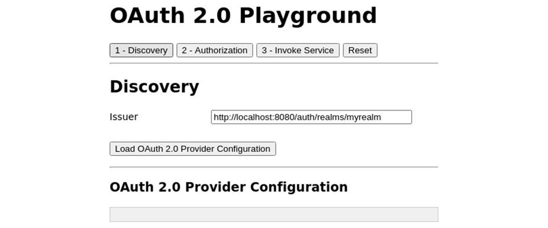
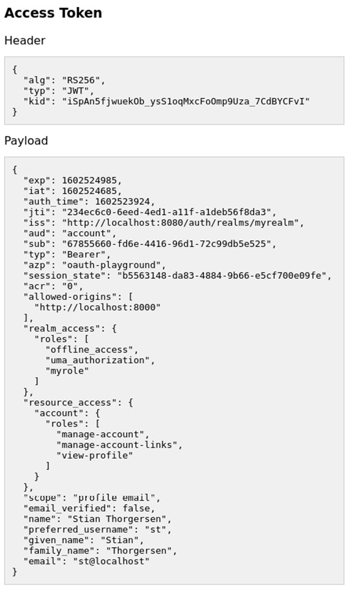
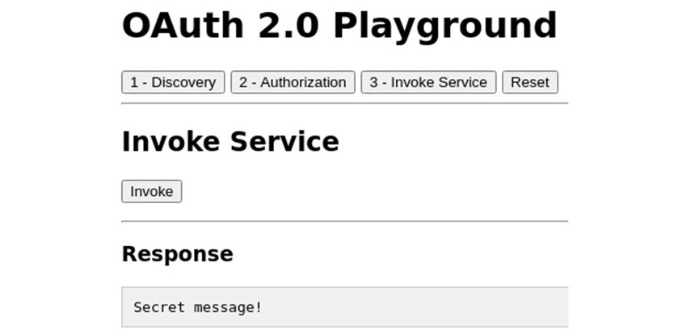
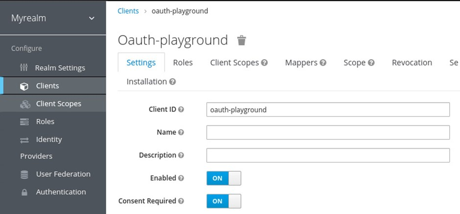
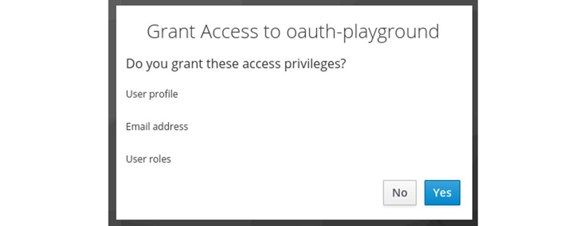
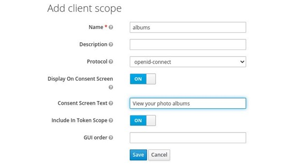
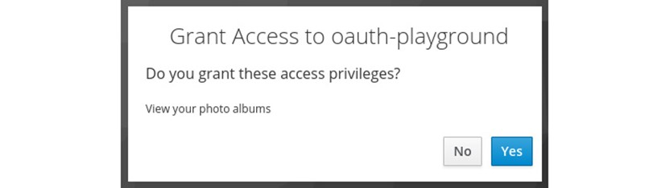
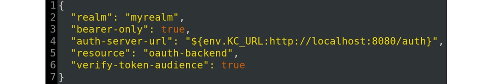
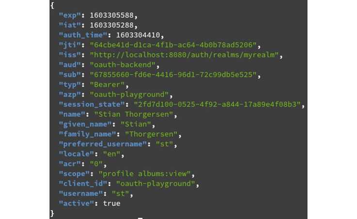

# Lab 4 : Running the OAuth 2.0 playground

For this lab, we are going to use the OAuth 2.0 playground, which is a basic Node JS that can be use to understand and experiment the OAuth 2.0 in a practical way.

It does not use any libraries for OAuth 2.0, but rather all OAuth 2.0 requests are crafted by the application itself. One thing to note here is that this application does not implement OAuth 2.0 in a secure way, and ignores optional parameters in the requests that are important for a production application. There are two reasons for this. Firstly, this is done so that you can focus on understanding the general concepts of OAuth 2.0. Secondly, if you decide to implement your own libraries for OAuth 2.0, you should have a very good understanding of the specifications, and it is beyond the scope of this training to cover OAuth 2.0 in that much detail.

# Starting the application :

There are two parts to the playground application: a frontend application and a backend application.

To run the playground application, open a terminal and run the following commands to start the frontend part:

```
$ cd lab4/oauth-playground/frontend/
$ npm install
$ npm start
```

Then, in a new terminal window, run the following commands to start the backend part:

```
$ cd lab4/oauth-playground/ch5/backend/
$ npm install
$ npm start
```

To verify that the application is running, open http://localhost:8000/ in your browser. The following screenshot shows the OpenID Connect Playground application:



In order to be able to use the playground application, you need Keycloak to be running, as well as to have a realm named myrealm with a user with the myrole global role and a client with the following configuration:

- Client ID: oauth-playground
- Access Type: public
- Valid Redirect URIs: http://localhost:8000/
- Web Origins: http://localhost:8000

## Obtaining an access token

Open the playground application at http://localhost:8000. First, you need to load the OAuth 2.0 provider configuration by clicking on the button labeled **Load OAuth 2.0 Provide Configuration**. After you've done this, click on the button labeled **2 – Authorization**. You can leave the **client_id** and **scope** values as they are, then click on the button labeled **Send Authorization Request**.

You will be redirected to the Keycloak login pages. Log in with the user you created in the first lab. After you have logged in and have been redirected back to the playground application, the access token is displayed in the **Access Token** section. As Keycloak uses **JSON Web Token (JWT)** for its default token format, the playground application is able to directly parse and view the contents of the access token.

In the OpenID Connect Playground application that you experimented with in the previous lab, you generated an authentication request, received an authorization code, then manually exchanged the authorization code for an ID token. As you've already experimented with this part, and it is completely the same flow for an OAuth 2.0 Authorization Code grant type, this flow has been simplified to a single step in the OAuth 2.0 Playground application.

The following screenshot shows an example access token from the playground application:



Let's take a look at some of the values within the access token:

- **aud**: This is a list of services that this token is intended to be sent to.
- **realm_access**: This is a list of global roles the token provides access to. It is a union of the roles a user has been granted, and the roles an application is allowed to access.
- **resource_access**: This is a list of client roles the token provides access to.
- **scope**: This is the scope included in the access token.

Now that the playground application has obtained an access token, let's try to invoke the REST API. Click on the button labeled **3 – Invoke Service**, then click on **Invoke**. You should now see a response that says **Secret message!**, as shown in the following screenshot:



You should now have a good understanding of how OAuth 2.0 can be leveraged to issue an access token to an application that allows the application to access resources on behalf of users.

In the next section, we will take a look at how the user can consent to grant the application access.

## Requiring user consent

When an application wants access to a third-party service on behalf of a user, the user will usually be asked whether they want to grant access to the application. Without this step, a user would not know what kind of access the application is getting, and if the user is already authenticated with the authorization server, the user may not even observe the application getting access.

In Keycloak, applications can be configured to either require consent or to not require consent. For an external application you should always require consent, but for an application you know and trust, you may choose to not require consent, which in essence means that you as an admin are trusting the application and are granting it access on behalf of users.

To try this out yourself, open the Keycloak admin console and navigate to the **oauth-playground** client. Then, turn on the **Consent Required** option, as shown in the following screenshot:



Once you have this enabled, go back to the playground application and obtain a new token by clicking on the button labeled **2 – Authorization**, followed by the button labeled **Send Authorization Request**. You should now see a similar screen to what is displayed in the following screenshot:



What type of **access privileges** the application is requesting is controlled by what **scopes** the application is requesting.

Let's give this a go by creating a new client scope and request this additional scope in the playground application.

Go back to the Keycloak admin console and click on **Client Scopes** in the menu on the left-hand side. Then, click on **Create**. Fill in the form with the following values:

- **Name**: albums
- **Display On Consent Screen**: ON
- **Consent Screen Text**: View your photo albums

The following screenshot shows the client scope that you should create:



You can leave the other values as is, then click on **Save**. Now, navigate to the **oauth-playground** client again, then click on **Client Scopes**. From the **Optional Client Scopes** section in **available client scopes**, select **albums** and click on **Add selected**.

Now, return to the playground application again, then click on the button labeled **2 – Authorization**. In the scope field, enter **albums**, then click on **Send Authorization Request**. This time, you should be prompted to grant access to view photo albums as shown in the following screenshot:



Keycloak remembers what consent a user has given to a particular application, which means the next time the application asks for the same scope, the user will not be prompted again.

In the next section, we will look at strategies for scoping access tokens, which in essence means controlling what access a token provides to the application.

## Limiting the access granted to access tokens

There are a few different strategies that can be used to limit access for a specific access token. These include the following:
- **Audience**: Allows listing the resource providers that should accept an access token.
- **Roles**: Through controlling what roles a client has access to, it is possible to control what roles an application can access on behalf of the user.
- **Scope**: In Keycloak, scopes are created through client scopes, and an application can only have access to a specific list of scopes. Furthermore, when applications require consent, the user must also grant access to the scope.

Let's go through these one at a time and see exactly how this can be done with Keycloak, starting with audience.

### Using the audience to limit token access

At the moment, access tokens issued to the frontend part of the playground application do not actually include the backend in the audience. The reason this works is that the backend part has not been configured to check the audience in the token.

Let's start with configuring the backend to check the audience. Stop the backend part, then open the [oauth-playground/backend/keycloak.json](./oauth-playground/backend/keycloak.json) file in a text editor. Change the value of the **verify-token-audience** field to **true**, as shown in the following screenshot:



One thing to notice in this file is the **resource** field, which is the value the backend will look for in the audience field to know whether it should accept the token.

Start the backend part again. Once started, go back to the playground application and obtain a new access token. If you look at the values for the access token, you will see the **aud** field, and you will also notice that **oauth-backend** is not included.

If you now try to invoke the service through the playground application, you will get a response telling you that access was denied. The backend is now rejecting the access token.

In Keycloak, there are two different ways to include a client in the audience. It can be done manually by adding a specific client to the audience with a protocol mapper (added directly to the client, or through a client scope), or it can be done automatically if a client has a scope on another client role from another client.

Let's try to add the audience manually with a protocol mapper. Open the Keycloak admin console and navigate to **Clients**. Create a new client with the **Client ID** value set as **oauth-backend**.

Then, click on Save. After it has been saved, change **Access Type** to **bearer-only**, and click **Save** again.

Now go back to the client list and open the **oauth-playground** client. Click on **Mappers**, then click on **Create**. Fill in the form with the following values:

- **Name**: backend audience
- **Mapper Type**: Audience
- **Included Client Audience**: oauth-backend
- Then, click on **Save**.
- Go back to the playground application and obtain a new access token. Now **oauth-backend** is included in the **aud** field, and if you again try to invoke the service through the playground application, you will get a successful response.

When looking at the **aud** field of the access token, you may have noticed that account was included. The reason this is included is that by default, a client has a scope on all roles, and by default, a user has a few client roles for the account client that provide the user access to the Keycloak account console. In the next section, we will take a closer look at how roles work.

### Using roles to limit token access

Keycloak has built-in support for roles, which can be used to grant users permissions. Roles are also a very useful tool to limit the permissions for an application as you can configure what roles are included in the access token for a given application.

A user has role mappings on a number of roles granting the user the permissions that the role provides. A client, on the other hand, does not have roles assigned directly to it but instead has a scope on a set of roles, which controls what roles can be included in the tokens sent to the client. This means that the roles included in tokens are the intersection between the roles a user has and the roles a client is allowed to use, as shown in the following diagram:


Let's try this out in the playground application. Before making any changes, obtain a new access token and take a look at the **aud**, **realm_access**, and **resource_access** claims. The following shows an example access token with all non-relevant claims removed:

```json
{
  "aud": [
    "oauth-backend",
    "account"
  ],
  "realm_access": {
    "roles": [
      "offline_access",
      "uma_authorization",
      "myrole"
    ]
  },
  "resource_access": {
    "account": {
      "roles": [
        "manage-account",
        "manage-account-links",
        "view-profile"
      ]
    }
  }
}      
```

Within the **aud** claim, you can see two clients. The **oauth-backend** client is included as we explicitly included this client in the audience in the previous section.

The **account** client, on the other hand, is included as the token includes roles for the account client, which by default results in the client automatically being added to the audience of the token as we can assume that if the token includes roles specifically for a client, the token is intended to be used to access this client.

You can also see that the token includes all roles granted to the user. By default, all roles for a given user are included in the token. This is for convenience when getting started with Keycloak and you should not include all roles in a production scenario.

Now, let's try to limit the role scope for the **oauth-playground** client to limit what is included in the token. Open the Keycloak admin console and navigate to the **oauth-playground** client. Then, click on the tab labeled Scope. You will notice that it has the **Full Scope Allowed** option turned on. This is the feature that by default includes all roles for a user in the tokens sent to this client.

Turn off **Full Scope Allowed**, then return to the playground application and obtain a new access token. In the new access token, you will notice that there are no longer any roles in the token and the **aud** claim now only includes the **oauth-playground** client. If you now try to invoke the service with this token, you will get an access denied message. This is because the service only permits requests that include the **myrole** role.

Go back to the Keycloak admin console and again open the scope tab for the **oauth-playground** client. Under **Realm Roles**, select the **myrole** role and click on **Add selected**. Return to the playground application and obtain a new access token, and you will now see that the **myrole** role is included in the **realm_access** claim, as shown in the following access token snippet:

```json
{
  "aud": "oauth-backend",
  "realm_access": {
    "roles": [
      "myrole"
    ]
  }
}
```

It is also possible to add scope through a client scope that is attached to a client. This may be a bit confusing as the term scope is somewhat overused within Keycloak. The following list tries to clarify this potential confusion:

- **A client has a scope on roles**: This is configured through the Scope tab for a client.
- **A client can access one or more client scopes**: This is configured through the **Client Scopes** tab for a client.
- **A client scope can also have a scope on roles**: When a client has access to a client scope that in turn has a scope on roles, the client has a scope on the roles that the client scope has.

As this may still be a bit confusing, let's experiment a bit with this in practice by leveraging the playground application.
Before continuing, you should first remove the scope that the **oauth-playground** client has on the **myrole** role. To do this, return to the Keycloak admin console, navigate to the **oauth-playground** client, and click on the **Scope** tab. Then, select the **myrole** role from the **Assigned Roles** section and click on **Remove selected**.

Now the tokens sent to the **oauth-playground** client no longer include the **myrole** role, which is exactly what we want as we will now add this through a client scope instead of directly to the client.

Open the Keycloak admin console and go to **Client Scopes**. Click on **Create** to create a new client scope. For the name, enter **myrole** and leave everything else as is, then click on **Save**. Now, select the tab labeled Scope. This is where you control what roles are included in the token when this client scope is included. Select the **myrole** role from **Available Roles** and click on **Add selected**.
You have now created a client scope that has a scope on the **myrole** role. Next, let's add this client scope as an optional client scope to the **oauth-playground** client. Navigate to the **oauth-playground** client and click on **Client Scopes**. In the **Optional Client Scopes** section, select **myrole** and click on **Add selected**.

As you added the **myrole** client scope as an optional client scope, it means the **myrole** role is only included in the token if the **oauth-playground** client explicitly requests the **myrole** scope.

Return to the playground application and obtain a new access token. You will see that the **myrole** role is not yet included in the realm_access claim. In fact, the realm_access claim should not be included at all since the client does not at this point have a scope on any global roles. In the Scope field, set the value to **myrole**, and click on **Send Authorization Request** to obtain a new access token that includes this scope. This results in the playground application requesting the **myrole** scope, which in turn will add the **myrole** role to the token.

In the next section, we will take a look at how scopes on their own can be leveraged to limit the access granted by a token.

### Using the scope to limit token access

Let's imagine that we have a photo album service that provides access to view albums, create albums, and delete albums. We'll also pretend that the playground application offers functionality to view and manage photo albums.
Start by creating the following three client scopes through the Keycloak admin console:

- albums:view
- albums:create
- albums:delete

We have already covered how to create client scopes previously, but in summary, the steps you need to create a client scope are as follows:

1. Open **Client Scopes** in the Keycloak admin console.
2. Click on the button labeled **Create**.
3. Enter the name from the preceding list, and enter some value for the **Consent Screen Text** field that describes to a user what permissions are given (for example, View photo albums).
4. Click on the button labeled **Save**.

After you have created the three client scopes, navigate to the **oauth-playground** client and click on **Client Scopes**. In the **Default Client Scopes** section, select albums:view and click on **Add selected**. Then, in the **Optional Client Scopes** section, select **albums:create** and **albums:delete**, then click on **Add selected**.

We added the scope to view permissions as a default scope as we're assuming that the playground application always requires viewing albums. On the other hand, we set the ability to create and delete albums as optional. This is sometimes referred to as incremental authorization, where the application requests additional permissions only when the user starts using a part of an application that requires the additional permissions. This approach makes it a lot more intuitive to the user why the application is requesting the permissions.

Before continuing, make sure the **oauth-playground** client requires consent by selecting the **Settings** tab and then checking that **Consent Required** is turned on.

Now, return to the playground application and remove any value in the Scope field before clicking on the **Send Authorization Request** button. Keycloak should now ask you to grant the **oauth-playground** application access to view photo albums, as shown in the following screenshot:


After clicking on **Yes**, the access token displayed within the playground application will include **albums:view** in the scope claim. Let's now imagine that the user would like to create a new photo album through the playground application, so it must have access to also create albums. Set the value of the scope field to **albums:create** and click on **Send Authorization Request** again. This time, you will be prompted to grant access to create photo albums. After clicking Yes, this time you will see that the scope claim in the access token now includes both **albums:view** and **albums:create**.

By now, you should have a good understanding of the different techniques for limiting the access provided by a given access token. In the next section, we will take a look at how an application can validate an access token.

### Validating access tokens

We have two choices to validate an access token, either by invoking the token introspection endpoint provided by Keycloak, or by directly verifying the token.

You can try to invoke the token introspection endpoint by using **curl** or any other tool that lets you send an HTTP request.

First, we need two things: the credentials for the **oauth-backend** client and an encoded access token.

To get the credentials for the **oauth-backend** client, go to the Keycloak admin console and navigate to the **oauth-backend** client. Then, click on **Credentials** and copy the value of the Secret field.

Open a terminal and set the secret to an environment variable as shown in the following example:

```
$ export SECRET=b1e0073d-3f2b-4ea4-bec0-a35d1983d5b6
```

Keep this terminal open, then open the playground application and obtain a new access token. At the bottom of the field, in the Encoded section, you will see the encoded access token. Copy this value, then set an environment variable in the terminal you opened previously as shown in the following example:

Now, you can invoke the token introspection endpoint by running the following command in the same terminal:

```
$ curl --data "client_id=oauth-backend&client_secret=$SECRET&token=$TOKEN" http://localhost:8180/auth/realms/myrealm/protocol/openid-connect/token/introspec
```

The endpoint will return a JSON document with the state of the token, and associated information for the token, as shown in the following screenshot:



The other approach to verifying access tokens issued by Keycloak is validating them directly in the application. As Keycloak uses JWT as its access token format, this means you can parse and read the contents directly from your application, as well as verifying that the token was issued by Keycloak as it is signed by Keycloak using its private signing keys. We're not going to go into detail on how to do this though, as there are quite a lot of mistakes you can make when verifying a token yourself and you should have a very good understanding of JWT as well as the information within the token before you consider implementing this approach yourself.

All Keycloak client libraries, which are referred to as application adapters by Keycloak, verify tokens directly without the token introspection endpoint. There are also a number of good libraries available for different programming languages you can use. To give you an idea though to verify an access token, you would need to do the following:

- Retrieve the public signing keys from the JWKS endpoint provided by Keycloak.
- Verify the signature of the access token.
- Verify that the access token has not expired.
- Verify the issuer, audience, and type of the token.
- Verify any other claims that your application cares about.

You should now have a good idea of how a service can verify a token either by using the token introspection endpoint or by directly verifying the token if it is a JWT.

## Summary
In this lab, you experienced first hand how to obtain access tokens using the OAuth 2.0 Authorization Code grant type. You learned how an admin can grant access to internal applications on behalf of a user, and how users themselves can grant access to third-party applications. You learned about various different techniques on how you can limit the access provided by a specific access token. Finally, you learned how a service can directly read and understand the contents of an access token issued by Keycloak, as it is using JWT-based tokens. You also learned how the token introspection endpoint can be leveraged to validate and discover information about an access token in a more standard and portable way.

You should now have a basic understanding of OAuth 2.0 and how it can be used to secure your own applications. We will build on this knowledge later in the up-coming lab to get you ready to start securing all your applications with Keycloak.


